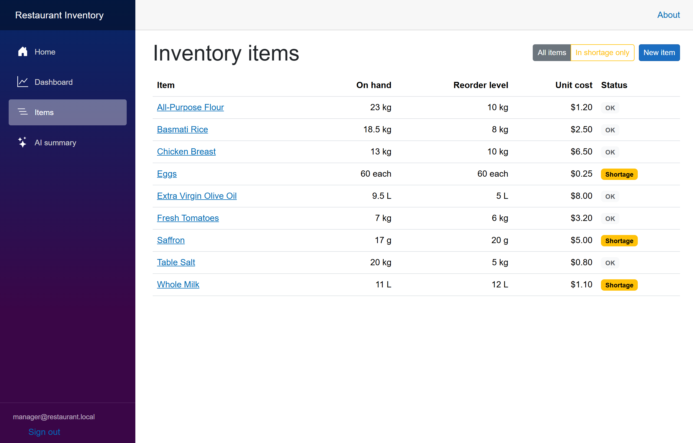
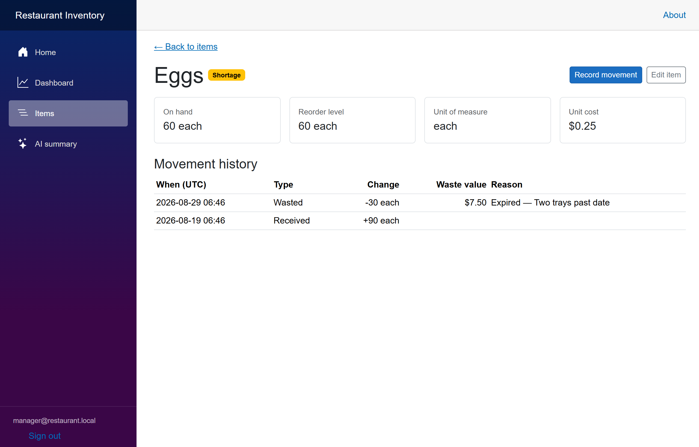
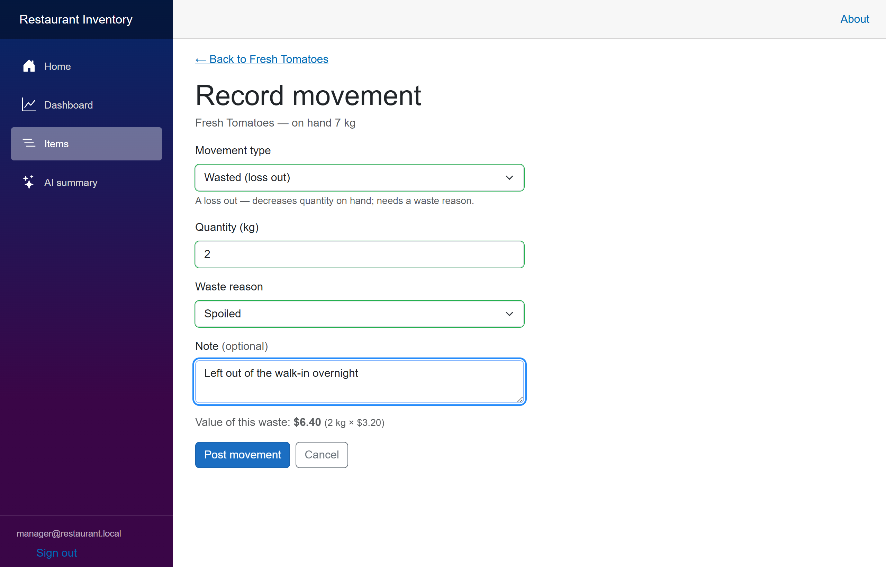
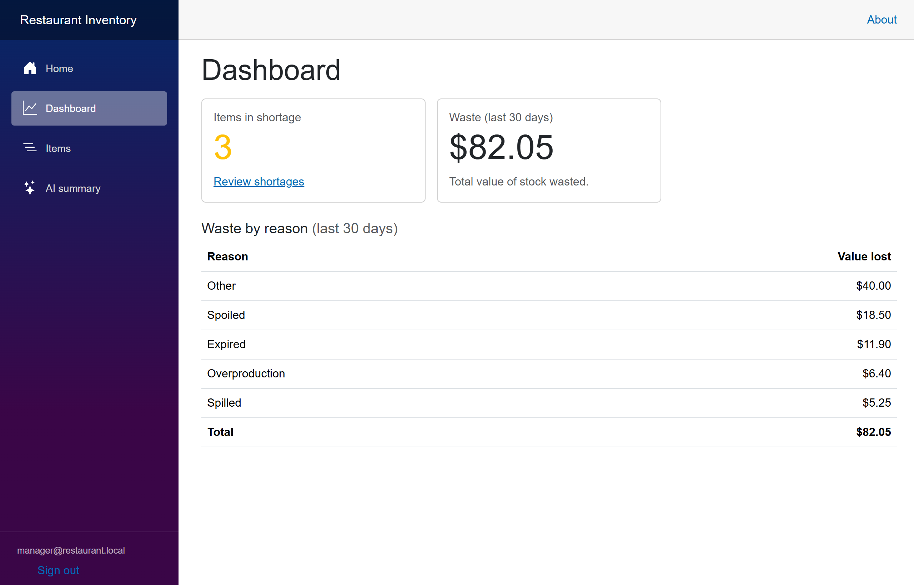
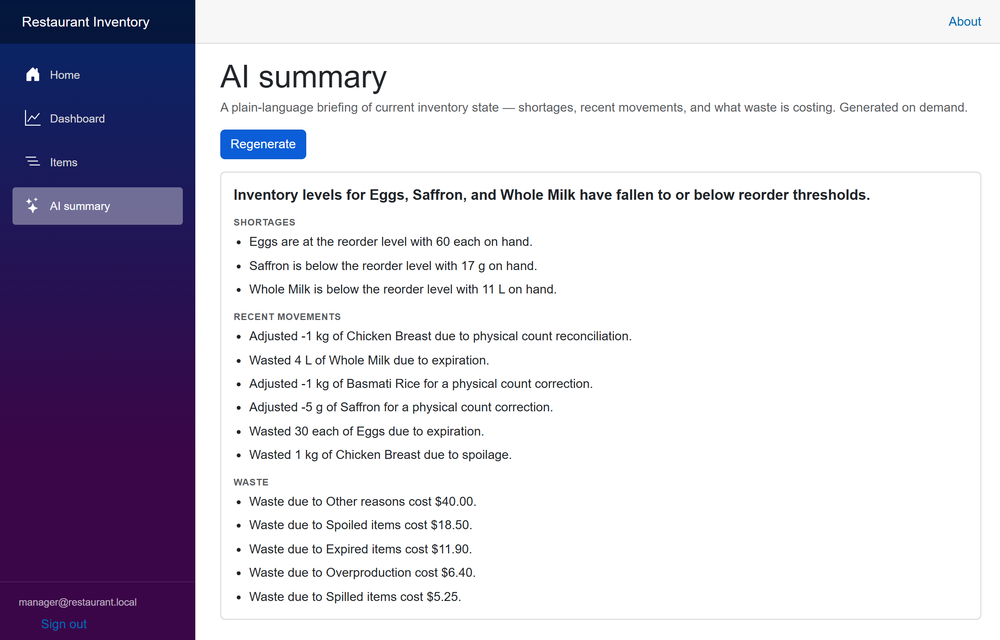
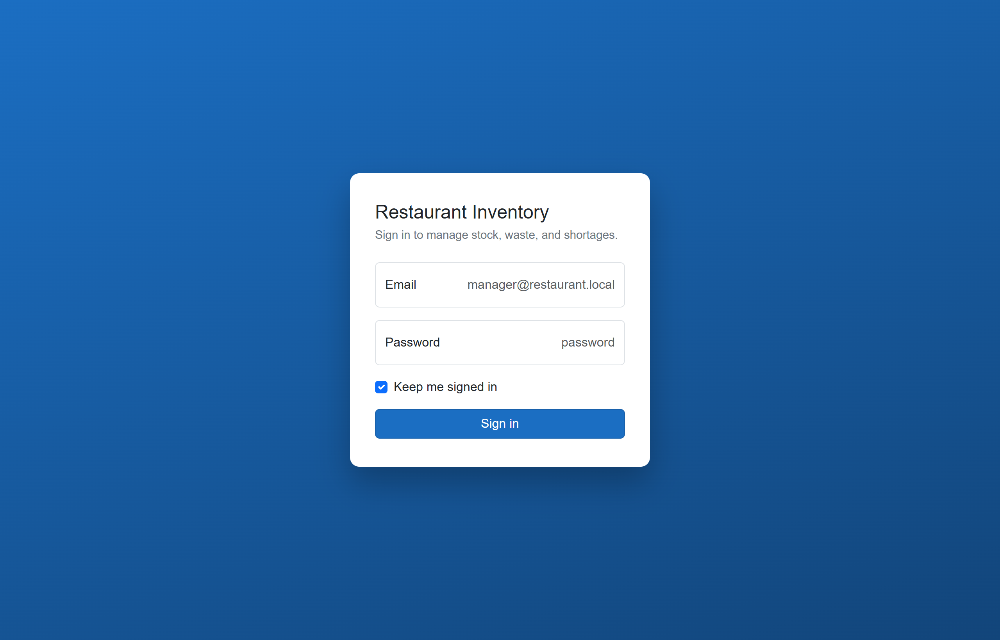

# Restaurant Inventory

A single-restaurant inventory system for one kitchen Manager: track the consumable
stock the kitchen holds, spot what has run low, and record waste honestly — with an
on-demand AI briefing of the current state. It exists to showcase a clean, auditable
.NET backend behind a thin-but-real Blazor UI.

The domain point is an **append-only ledger**: an item's quantity is never an editable
field, it's the running sum of every `StockMovement` (Received / Wasted / Adjusted).
That makes waste and shortage first-class, reportable, and impossible to quietly
overwrite.



## Quick start (clone and run in ~30s)

**Prerequisite:** the [.NET 10 SDK](https://dotnet.microsoft.com/download).

```bash
git clone https://github.com/hzkueh/RestaurantInventory.git
cd RestaurantInventory
dotnet run --project src/RestaurantInventory.Web
```

Then open **<http://localhost:5066>**.

That single command restores, builds, and starts the app. On startup it **applies EF
Core migrations** (creating a local SQLite file) and **seeds** a Manager account plus a
realistic catalogue of items and stock movements — so every screen is populated with no
manual setup. The seed is idempotent: it runs once and is a no-op on later starts.

### Sign in

| Field    | Value                     |
| -------- | ------------------------- |
| Email    | `manager@restaurant.local` |
| Password | `Manager!1`               |

These are demo credentials for a single-restaurant portfolio app, seeded from the
`SeedManager` section of `appsettings.json` — not real secrets.

### Optional: the AI summary key

The **AI summary** page calls Google Gemini (free tier) to narrate the current inventory
state. It is entirely optional — **the app runs fully without a key**, and the summary
page simply reports itself unavailable while every other screen works normally.

To enable it, copy the template and drop in a key from
[Google AI Studio](https://aistudio.google.com/apikey):

```bash
cp .env.example .env
# then set Gemini__ApiKey= in .env
```

`.env` is git-ignored (see [ADR-0002](docs/adr/0002-ai-insight-provider.md)); only the
empty `.env.example` is committed.

## Screens

| | |
| --- | --- |
| **Items list** — current quantity on hand, reorder level, and a computed Shortage badge; filterable to shortages only. | **Item detail** — the full append-only movement history that produced the current quantity. |
|  |  |
| **Record movement** — a type-aware form; Wasted reveals a required reason, an optional note, and a live money value. | **Dashboard** — the shortage headline count and waste-by-reason in dollars over the recent window. |
|  |  |
| **AI summary** — an on-demand, plain-language briefing of shortages, recent movements, and waste totals. | **Sign in** — cookie-based ASP.NET Core Identity guarding every inventory page. |
|  |  |

## Architecture

**Stack:** ASP.NET Core + Blazor Server (interactive server rendering), EF Core + SQLite,
ASP.NET Core Identity (cookie auth), xUnit — one .NET 10 solution, all C#.

### The StockMovement ledger + derived QuantityOnHand ([ADR-0001](docs/adr/0001-stockmovement-ledger.md))

An `InventoryItem`'s quantity is **never** a mutable authoritative field. Every change to
stock is an append-only `StockMovement` — `Received` (delivery in), `Wasted` (loss out,
with a required `WasteReason`), or `Adjusted` (a ± physical-count correction) — each
carrying quantity, timestamp, and reason. `QuantityOnHand` is the sum of those movements,
**cached** on the item for fast reads and updated inside the same operation that appends
the movement, so reads and the cache never diverge. This is a derived-and-snapshotted read
model, not full event sourcing — the movements remain the source of truth. Mistakes are
corrected by posting a **compensating movement**, never by editing history.

`Shortage` (`QuantityOnHand <= ReorderLevel`) is likewise a **computed query, never a
stored flag**.

### The inventory service seam

A single application service, [`InventoryService`](src/RestaurantInventory.Core/Services/InventoryService.cs),
owns all ledger behaviour and is the one seam below the Blazor UI: post a validated
movement, maintain the cached quantity, query which items are in Shortage, and aggregate
Waste by reason in money over a recent window. Blazor pages are thin callers of it. This
is the primary test target — its behaviour is exercised through the seam (resulting
quantities, shortage boundaries, waste totals, validation rejections), never against
private fields, so tests survive a refactor of *how* the cache or queries are implemented.

### The AI insight seam — `IInventoryInsightService` ([ADR-0002](docs/adr/0002-ai-insight-provider.md))

The AI summary page depends only on the application-owned
[`IInventoryInsightService`](src/RestaurantInventory.Core/Services/Insight/IInventoryInsightService.cs)
interface. `GeminiInsightService` implements it with a typed `HttpClient` via
`IHttpClientFactory` (no third-party AI SDK). Swapping providers is a single new
implementation of the interface — the UI never references Gemini. With no key configured
the implementation degrades gracefully to an "unavailable" result, so the optional AI
feature is never on the critical path of core inventory operations, and the page is
testable without a network by mocking the interface.

### Project layout

```
src/
  RestaurantInventory.Core/   Domain, EF Core persistence, InventoryService, insight seam
  RestaurantInventory.Web/    Blazor Server UI, Identity, Gemini implementation, startup
tests/
  RestaurantInventory.Tests/  xUnit — ledger unit tests + SQLite in-memory integration tests
docs/
  DESIGN.md, adr/             Design notes and architecture decision records
```

The `Core` project has no dependency on ASP.NET or Identity: auth lives entirely in `Web`
in its own `DbContext` (and its own migrations-history table) inside the same SQLite file,
keeping the domain clean.

## Tests

```bash
dotnet test
```

The suite has two layers: fast, pure **unit tests** on the ledger math (movement sequences
and resulting quantity, the shortage boundary at exactly `QuantityOnHand == ReorderLevel`,
validation rules, waste aggregation and its recent-window boundary), and **SQLite
in-memory integration tests** that confirm the same behaviours through EF Core — including
that the cached quantity persists and reloads correctly and that movements are insert-only.
The AI summary page is tested against a mocked `IInventoryInsightService`, including the
graceful "unavailable" path; the live Gemini endpoint is never called from tests.

## Further reading

- [Spec](.scratch/restaurant-inventory-mvp/spec.md) — problem, solution, and user stories
- [CONTEXT.md](CONTEXT.md) — the domain vocabulary (ubiquitous language)
- [docs/DESIGN.md](docs/DESIGN.md) — design notes and the scope Cut line
- [ADR-0001](docs/adr/0001-stockmovement-ledger.md) · [ADR-0002](docs/adr/0002-ai-insight-provider.md) — architecture decisions

## Scope

Deliberately a single-restaurant, single-Manager MVP. Suppliers and purchase orders,
shortage email alerts, durable-goods tracking, recipes and consumption deduction,
multi-user roles, CSV/PDF export, and unit conversion are all out of scope — see the Cut
line in [DESIGN.md](docs/DESIGN.md) and the Out-of-scope notes in
[CONTEXT.md](CONTEXT.md).
